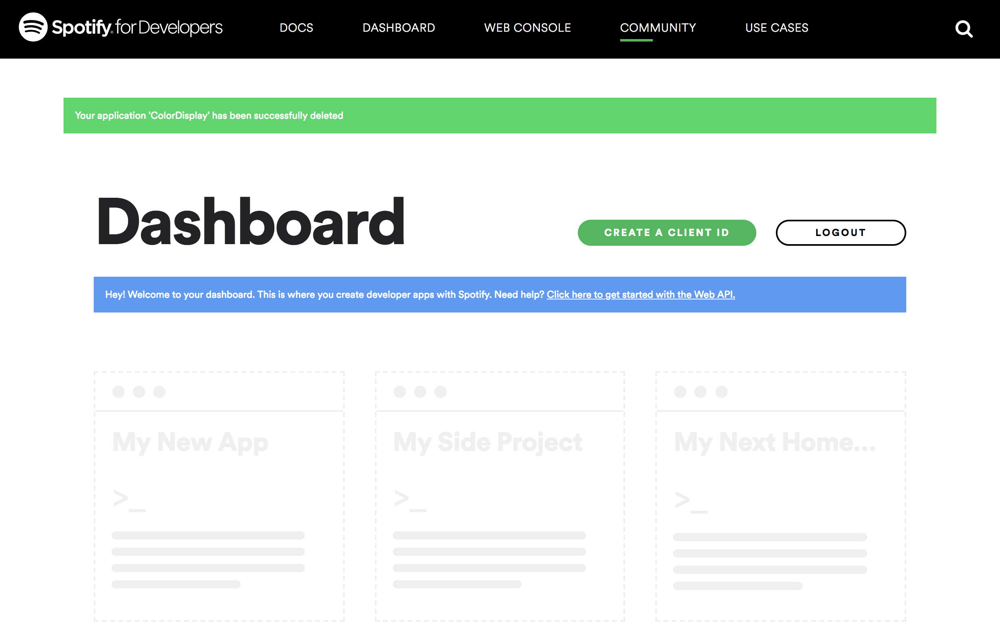
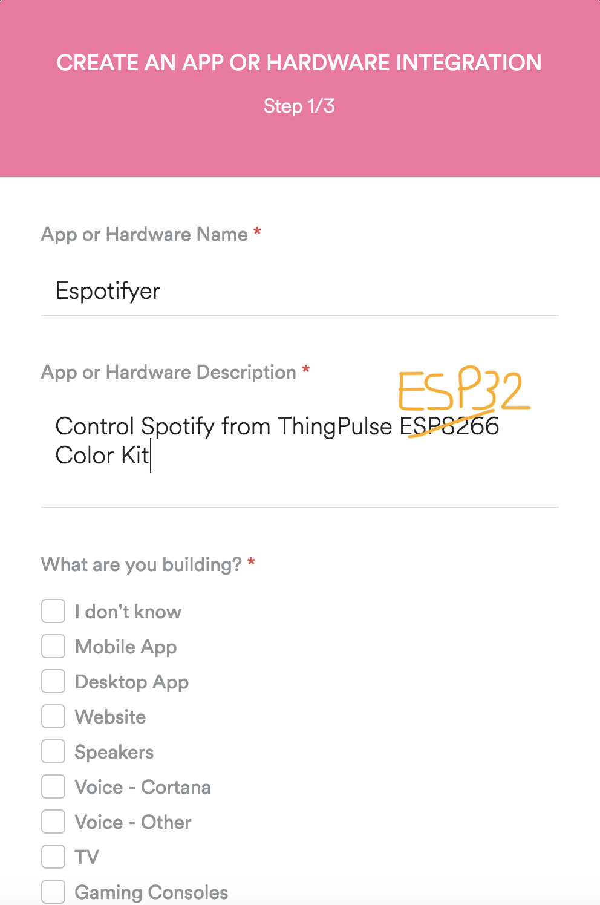
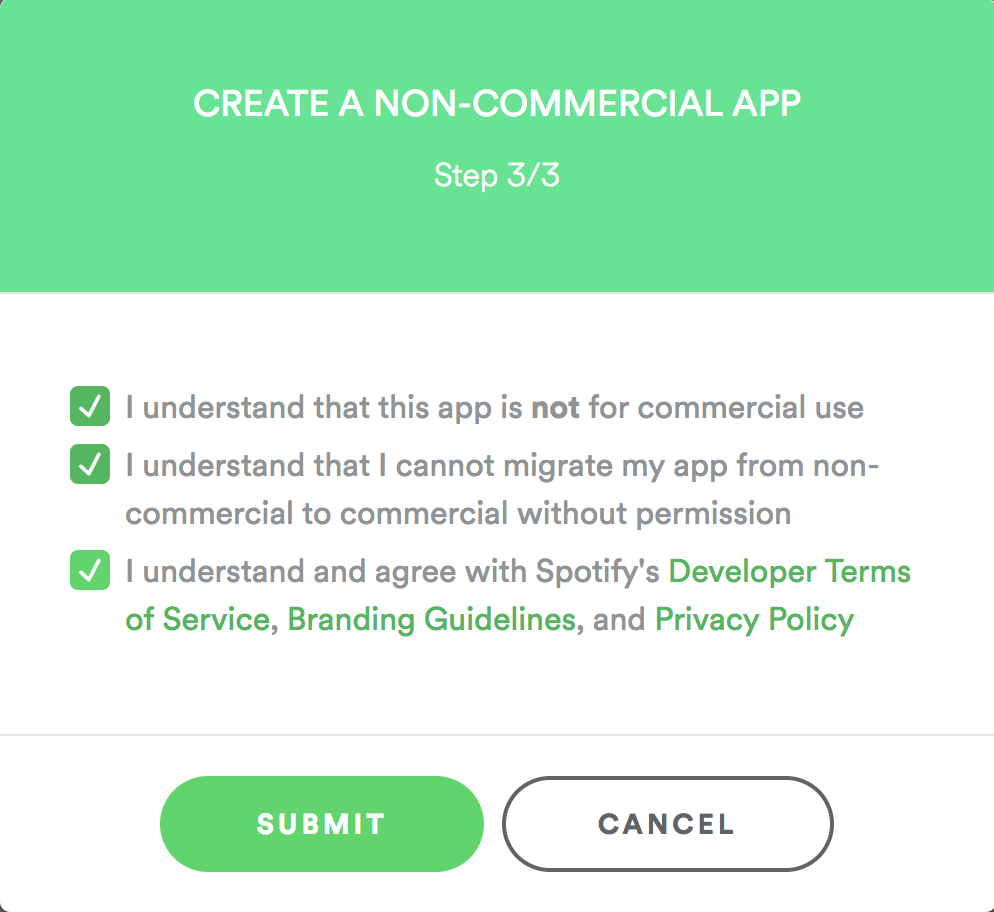
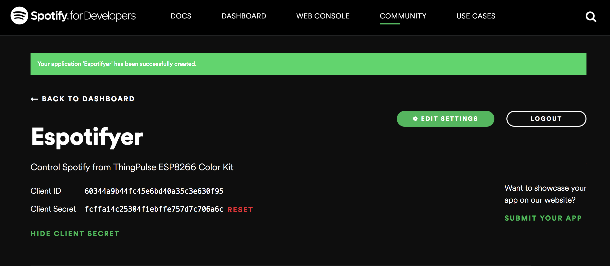
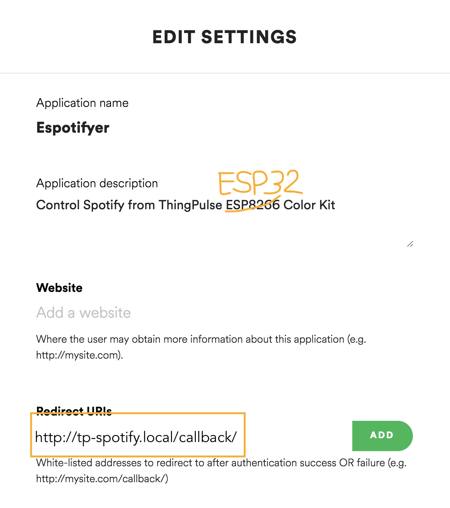
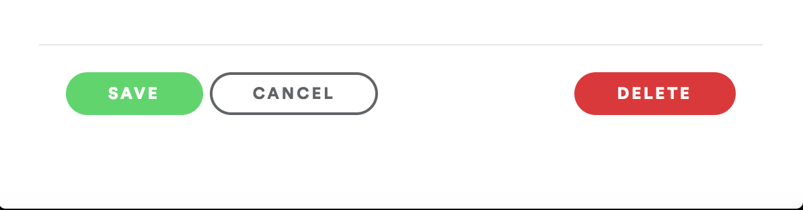

# Color Kit Grande Spotify Controller

Spotify controller application for the [ThingPulse Color Kit Grande](https://thingpulse.com/product/esp32-wifi-color-display-kit-grande/).

## Purpose of this project

Using the ThingPulse Spotify Controller you control a Spotify player (phone, browser, etc) from an Espressif ESP32 microcontroller.
Album artwork as well as title and artist name are loaded from the Spotify Web API over WiFi and displayed on a color TFT touch-screen.
The currently playing song can be paused, resumed and skipped to the next or previous song in the playlist.

A full OAuth 2.0 web flow is used to acquire the necessary access and refresh tokens to permit the user to control the player.
In order to run this project on your device, you will need to setup an application on your Spotify dashboard (instructions below).

## Features

 - Artwork download
 - Control player on touch screen: play, Pause, next, prev
 - Authentication and authorization (OAuth 2.0 flow) on device.

## Service level promise

<table><tr><td>
</td><td>This is a ThingPulse <em>community</em> project. See our <a href="https://thingpulse.com/about/open-source-commitment/">open-source commitment declaration</a> for what this means.</td></tr></table>

## Setup instructions

### Precondition

The below instructions assume a properly configured Visual Studio Code installation with PlatformIO.
See our [instructions](https://docs.thingpulse.com/guides/esp32-color-kit-grande/#development-environment) if you need help with this.

### Get access to the Spotify API

1. Go to [https://developer.spotify.com/dashboard/login](https://developer.spotify.com/dashboard/login) and login to or sign up for the Spotify Developer Dashboard

2. Select "My New App"

   

3. Fill out the form. Give your new app a name you can attribute to this project.
It's safe to select "I don't know" for the type of application.

   

4. At the end of the 3 steps click "Submit"

   

5. Set the unique Client ID and Client Secret as values for the respective variables in `settings.h`.

   

6. Click on "Edit Settings". Add "http://tp-spotify.local/callback/" to the Redirect URIs section.

   **NOTE** If you are running more than ThingPulse Spotify Remote in the same WiFi network, you should choose a unique name rather than "tp-spotify". Regardless of what you choose it has to reflect what you set for `SPOTIFY_ESPOTIFIER_NODE_NAME` in `settings.h` in the project.

   

7. Don't forget to save your settings.
   
