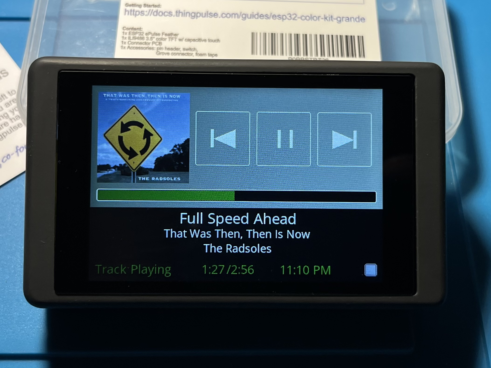
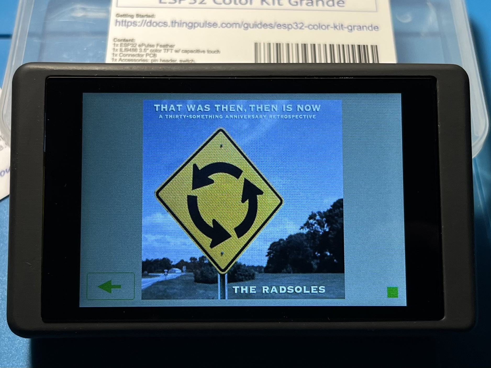
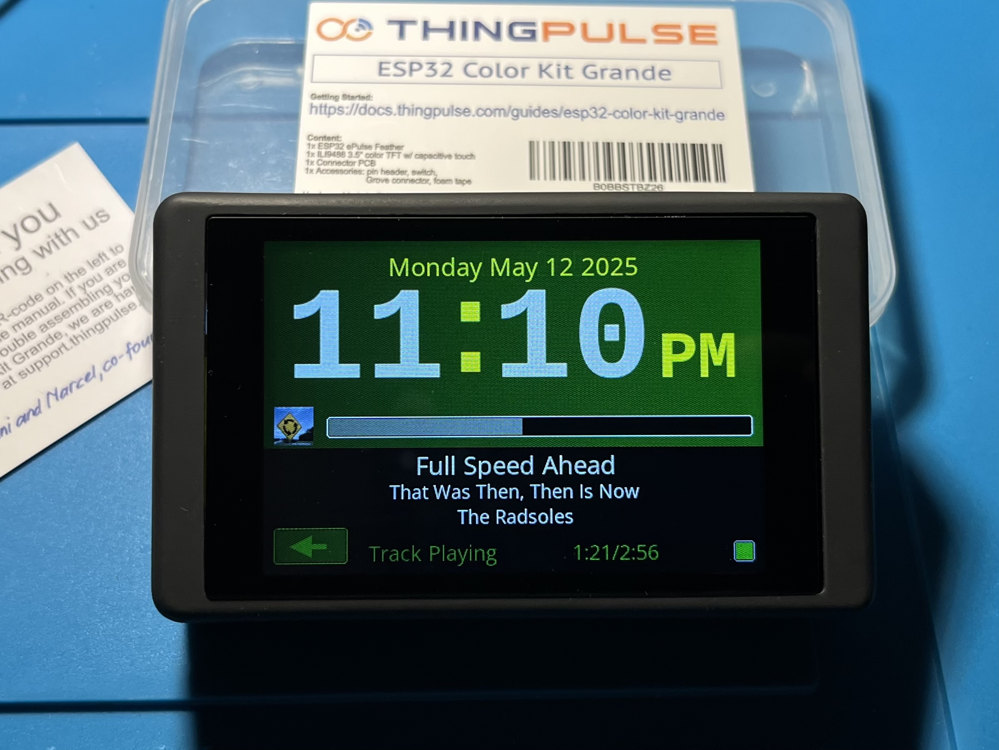
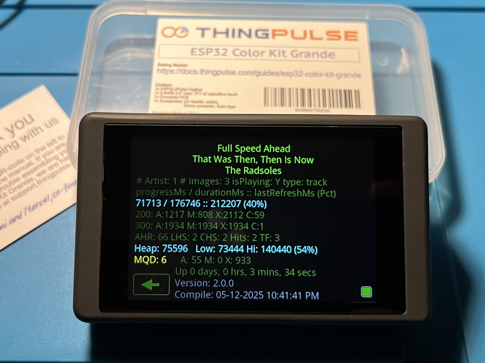
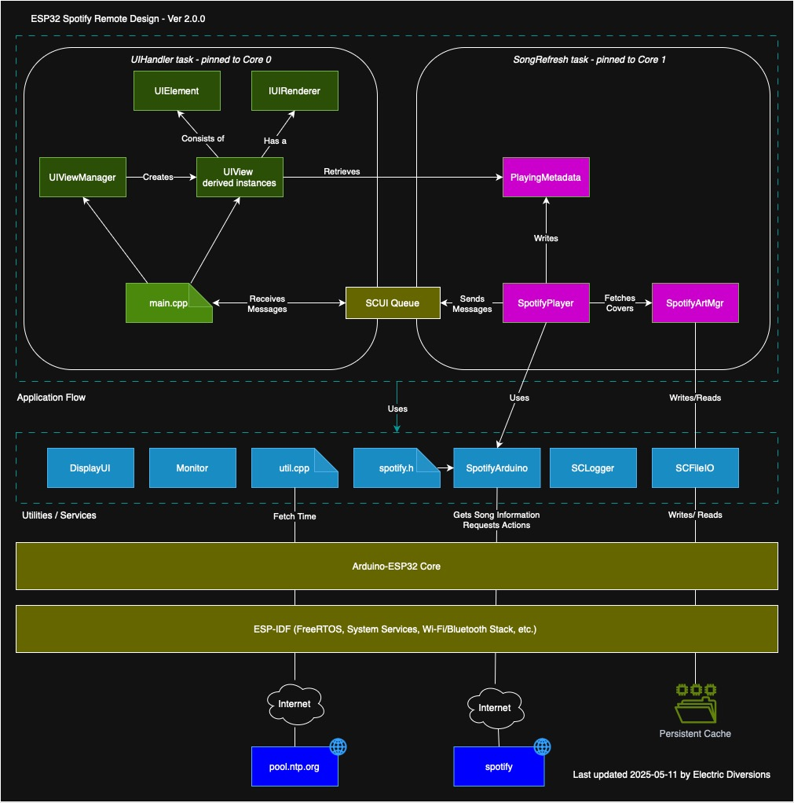
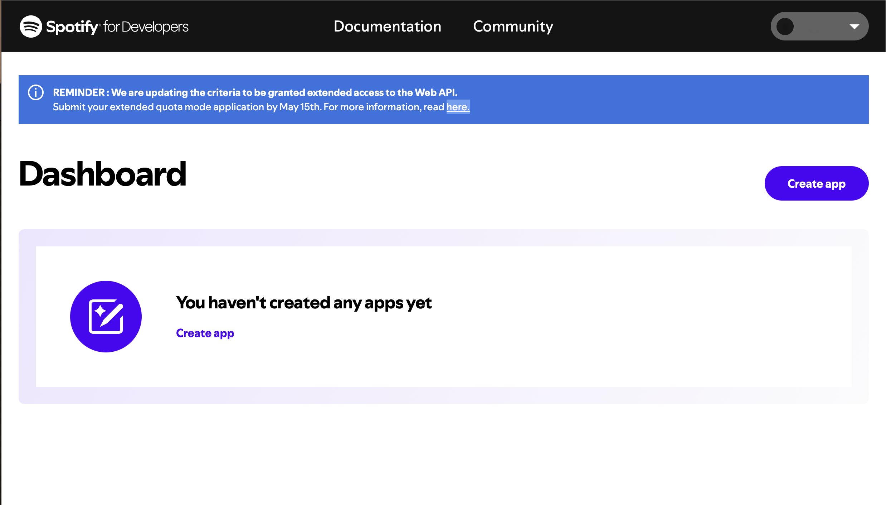
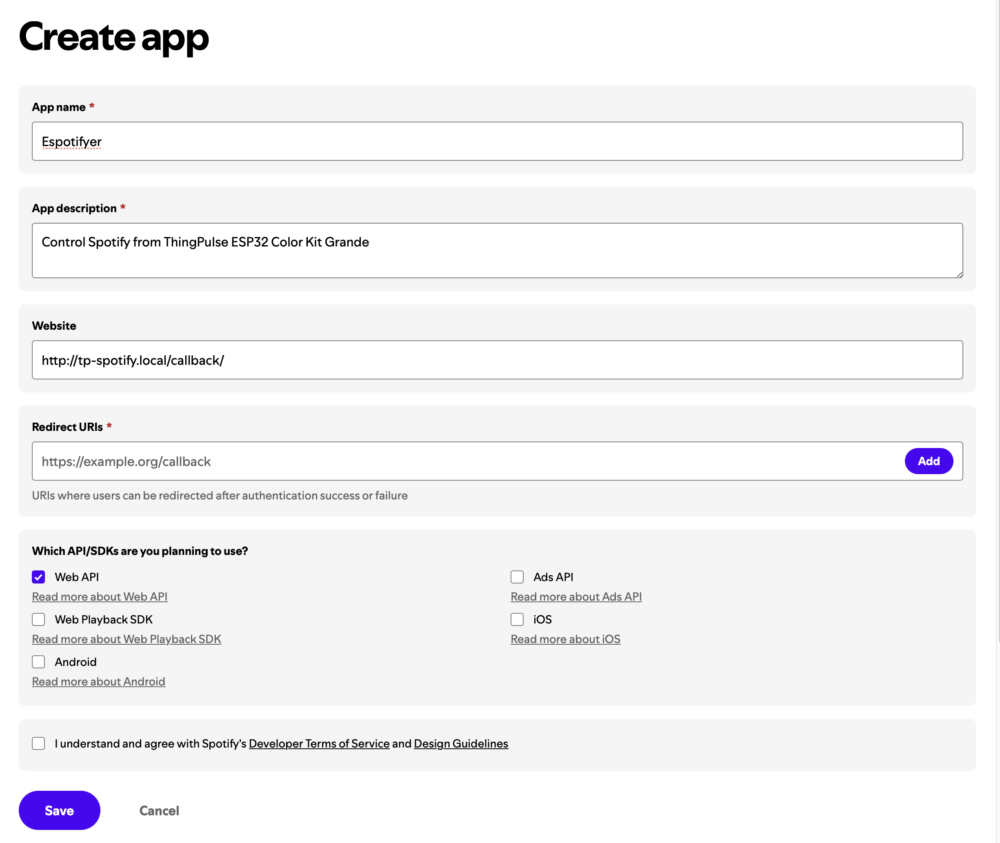
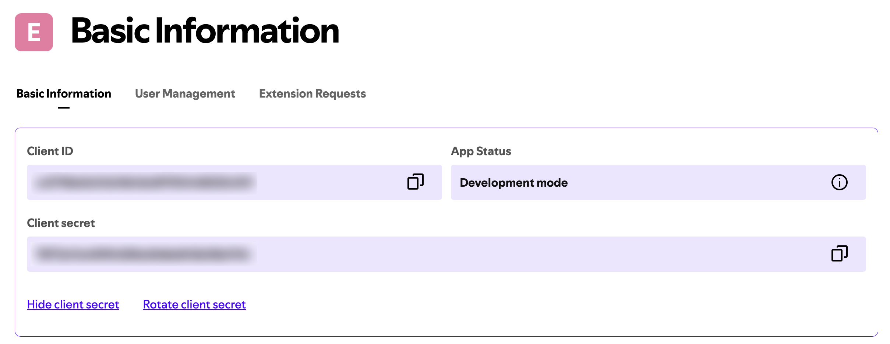

# Color Kit Grande Spotify Controller

Spotify controller application for the [ThingPulse Color Kit Grande](https://thingpulse.com/product/esp32-wifi-color-display-kit-grande/).

<!-- Main image -->

<!-- Thumbnails -->

  
  
  

## Purpose of this project

Using the ThingPulse Spotify Controller you control a Spotify player (phone, browser, etc) from an Espressif ESP32 microcontroller.
Album artwork as well as title and artist name are loaded from the Spotify Web API over WiFi and displayed on a color TFT touch-screen.
The currently playing song can be paused, resumed and skipped to the next or previous song in the playlist.

A full OAuth 2.0 web flow is used to acquire the necessary access and refresh tokens to permit the user to control the player.
In order to run this project on your device, you will need to setup an application on your Spotify dashboard (instructions below).

 ## Features

- **Spotify Playback Control**
  - Play, pause, skip to next/previous track from the touch screen
  - Control playback on any active Spotify Connect device linked to your account (e.g., phone, browser, smart speaker)

- **Album Art Display**
  - Downloads and displays album artwork via Spotify Web API
  - Caches artwork locally for performance

- **Multiple UI Modes**
  - Home view with track metadata and album art
  - Cover Art only view
  - Clock view with time and playback progress
  - Diagnostics view with system stats and Spotify state

- **OAuth 2.0 Authorization Flow**
  - Authentication and authorization (OAuth 2.0 flow) on device

- **Designed for ESP32 + TFT Touch**
  - Built using PlatformIO and Arduino
  - Touch event handling for UI buttons and screen navigation
  - Takes advantage of ESP32 dual-core architecture: UI logic runs on one core, while background tasks (e.g., album art refresh) run on the other

- **Extensible Design**
  - Modular architecture allows easy addition of new Views (UI screens)
  - Built-in monitoring tools for measuring system performance and UI responsiveness
  - Structured and tag-based logging system for easier debugging and analysis

<!--Design Context Diagram -->

## Using the Spotify Controller

- Tap the **Prev**, **Pause/Play**, and **Next** buttons to control music playback.
- Tap the **album art** on the Home view to switch to the **Cover Art view**.
- Tap the **clock** to switch to the **Clock view**.
- Tap the **network status box** in the lower-right corner to open the **Diagnostics view**.

> For detailed display logic and diagnostics layout, see `DiagnosticsView.cpp`.

## Service level promise

<table><tr><td>
</td><td>This is a ThingPulse <em>community</em> project. See our <a href="https://thingpulse.com/about/open-source-commitment/">open-source commitment declaration</a> for what this means.</td></tr></table>

## Setup instructions

### Precondition

The below instructions assume a properly configured Visual Studio Code installation with PlatformIO.
See our [instructions](https://docs.thingpulse.com/guides/esp32-color-kit-grande/#development-environment) if you need help with this.

### Get access to the Spotify API

1. Go to [https://developer.spotify.com/dashboard/login](https://developer.spotify.com/dashboard/login) and login to or sign up for the Spotify Developer Dashboard

2. Select "Create app"

   

3. Fill out the form. Give your new app a name you can attribute to this project.
It's safe to select "I don't know" for the type of application.
Add "http://tp-spotify.local/callback/" to the Redirect URIs section.

   **NOTE** If you are running more than ThingPulse Spotify Remote in the same WiFi network, you should choose a unique name rather than "tp-spotify". Regardless of what you choose it has to reflect what you set for `SPOTIFY_ESPOTIFIER_NODE_NAME` in `spotify.h` in the project.

   

   **Don't forget to save your settings.**

4. Set the unique Client ID and Client Secret as values for the respective variables in `spotify.h`.

   

